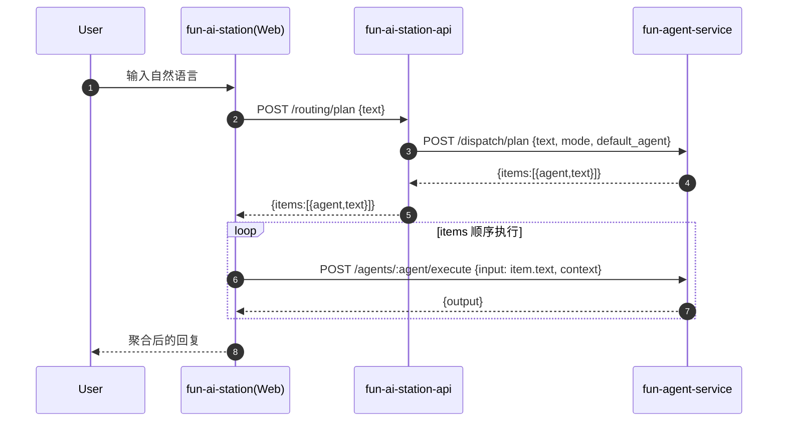
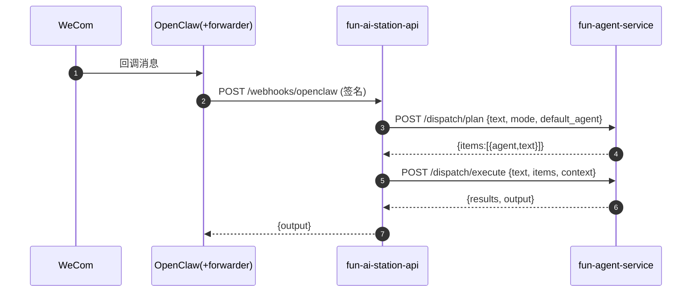

### 编排层（Orchestrator）架构与使用说明

本文档用于记录当前 **多智能体协同编排层** 的架构与使用方式，便于后续排查与演进（包括未来把编排层独立拆分成单独服务）。

---

## 1) 背景与目标

在“自然语言自动调度”场景里，如果路由器只返回“要调用哪些智能体”，但 **每个智能体仍拿到整段原文**，会导致：

- 多个智能体各自泛泛而谈，互相覆盖/甩锅；
- 输出不聚焦，难以实现真正的多智能体协作；
- 需要前端/机器人侧自己做拆分，逻辑分散且难以一致。

本次改动的目标是：

- **编排层直接产出每个智能体的子任务文本**：`items: [{agent,text}]`
- **执行时严格按 items 顺序调度**，每个智能体只处理自己的 `text`
- Web 前端与企业微信/OpenClaw 两端尽量复用同一套 `items` 计划

---

## 2) 当前架构（编排层放在 fun-agent-service）

为了让“路由 + 执行”与具体智能体运行时更贴近，并且便于未来独立拆分，本阶段将编排层放在 `fun-agent-service` 内部提供 HTTP 能力，`fun-ai-station-api` 作为入口服务通过 HTTP 调用编排层。

### 2.1 组件职责

- **fun-agent-service（Node + Python）**
  - 智能体运行时：`POST /agents/:agent/execute`
  - 编排层（新增）：
    - `POST /dispatch/plan`：生成顺序调度计划（items）
    - `POST /dispatch/execute`：按 items 顺序执行并聚合输出
  - 编排实现（Python）：
    - `fun-agent-service/agents/orchestrator.py`
    - `fun-agent-service/orchestrator_runtime.py`

- **fun-ai-station-api（FastAPI）**
  - 入口与持久化（会话/消息/事件去重）
  - 路由/编排调用方（HTTP Client）：
    - `fun-ai-station-api/src/core/orchestrator_client.py`
  - 配置项（为未来拆分预留口子）：
    - `ORCHESTRATOR_URL`（默认回退到 `FUN_AGENT_SERVICE_URL`）

---

## 3) 典型链路

### 3.1 Web（站内对话）

> Web 侧目前采用：后端产出 items，前端按 items 顺序逐个调用 agent execute。



### 3.2 企业微信 / OpenClaw（webhook）

> OpenClaw webhook 侧采用：后端拿到 items 后直接调用 `dispatch/execute` 完成顺序执行与聚合。



---

## 4) API 说明（fun-agent-service）

### 4.1 生成计划：`POST /dispatch/plan`

请求：
```json
{
  "text": "用户输入",
  "mode": "hybrid",
  "default_agent": "general",
  "context": { "trace_id": "..." }
}
```

响应：
```json
{
  "ok": true,
  "mode": "hybrid",
  "default_agent": "general",
  "items": [
    { "agent": "log", "agent_name": "log助手", "text": "...", "depends_on": [] },
    { "agent": "mail", "agent_name": "邮件助手", "text": "...", "depends_on": ["log"] }
  ]
}
```

说明：
- `items[*].text` 是 **分配给该 agent 的子任务文本**（不应重复整段原文）。
- `items[*].depends_on` 表示该 agent 需要引用的前置 agent（只允许引用更早的步骤）。

### 4.2 执行计划：`POST /dispatch/execute`

请求（推荐把 `items` 一并传入，保证“计划与执行一致”）：
```json
  {
    "text": "用户输入",
    "items": [
      { "agent": "log", "text": "...", "depends_on": [] },
      { "agent": "mail", "text": "...", "depends_on": ["log"] }
    ],
    "mode": "hybrid",
    "default_agent": "general",
    "context": { "trace_id": "..." }
  }
```

响应：
```json
{
  "ok": true,
  "items": [
    { "agent": "log", "text": "..." },
    { "agent": "mail", "text": "..." }
  ],
  "results": [
    { "agent": "log", "agent_name": "log助手", "output": "..." },
    { "agent": "mail", "agent_name": "邮件助手", "output": "..." }
  ],
  "output": "聚合后的最终文本"
}
```

---

## 5) 路由策略（mode）

编排层支持三种路由模式（由 `fun-ai-station-api` 的 `ROUTER_MODE` 控制并透传）：

- `hybrid`（默认推荐）：`@显式提及` > `LLM 路由` > `关键词路由` > `default_agent`
- `llm`：`@显式提及` > `LLM 路由` > `default_agent`
- `keywords`：`@显式提及` > `关键词路由` > `default_agent`

额外规则（提升体验）：
- **log 快捷路由**：当消息明显在请求“查看某个 log 文件路径”时，即使没有 `@log助手` 也会优先给 `log`。

---

## 6) 执行时的上下文（用于轻量协同）

编排层顺序执行时，会在每个 agent 的 `context.dispatch` 中放入：

- `index` / `total`：当前步骤序号与总数
- `agent` / `agent_name`
- `original_input`：原始用户输入（仅用于参考，不建议 agent 基于它扩展到别的任务）
- `depends_on`：当前 agent 依赖的前置 agent 列表
- `dependencies`：根据 depends_on 筛选后的前置输出（用于协作：后续 agent 直接引用）
- `previous`：前面步骤的输出列表（兼容字段）

这是一种 **轻量协同**：不做复杂的多轮 Planner/Reviewer，而是先把“每个 agent 只做自己那一段”做好。

---

## 6.1 第二回合：汇总助手（synthesizer）
当计划包含多个 agent 时，执行完第一回合后，会触发一次“汇总助手”生成最终回复：

- agent code：`synthesizer`（display：汇总助手）
- 输入：由系统拼装的“用户原始问题 + 各智能体输出”
- 输出：最终给用户的统一答复（不逐条复述）

如需关闭，可将 `DISABLED_AGENTS` 中加入 `synthesizer`，或直接禁用该 agent。

---

## 7) fun-ai-station-api 如何使用编排层（配置与回退）

### 7.1 配置项

在 `configs/fun-ai-station-api.env` 中：

- `FUN_AGENT_SERVICE_URL=http://127.0.0.1:4010`
- `ORCHESTRATOR_URL=`（空则默认等于 `FUN_AGENT_SERVICE_URL`）

### 7.2 回退策略

当编排层不可用时（网络/超时等），`fun-ai-station-api` 会：

- 规划（plan）阶段：回退到 API 内置路由（`src/core/agent_routing.py`）
- 执行（execute）阶段：回退到 API 侧顺序调用 `fun-agent-service /agents/:agent/execute`

---

## 8) 未来独立拆分编排层（预留口子）

当前编排层虽在 `fun-agent-service` 内，但 `fun-ai-station-api` 已通过 `ORCHESTRATOR_URL` 解耦。

未来若要拆成单独项目/服务，只需：

1) 新服务实现同样的 HTTP 协议：
   - `POST /dispatch/plan`
   - `POST /dispatch/execute`
2) 配置 `ORCHESTRATOR_URL=http://<new-orchestrator>`

即可在不改动入口业务逻辑的前提下完成迁移。
